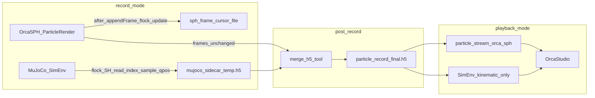

# 粒子录制 + MuJoCo 全状态耦合回放 — 设计说明

**版本**: 1.0  
**日期**: 2026-04-14  
**状态**: 设计规格（实现前）  
**关联代码（规划落点）**: [`examples/fluid/run_fluid_sim.py`](../../../examples/fluid/run_fluid_sim.py)、[`launch/run_simulation.py`](../launch/run_simulation.py)、[`launch/fluid_session.py`](../launch/fluid_session.py)、[`launch/sph_config.py`](../launch/sph_config.py)、[`sim_env.py`](../sim_env.py)；SPlisHSPlasH：[`ParticleRenderBridge.cpp`](../../../../SPlisHSPlasH/Orca/ParticleRender/ParticleRenderBridge/ParticleRenderBridge.cpp)、[`ParticleHdf5Recorder.cpp`](../../../../SPlisHSPlasH/Orca/ParticleRender/ParticleRenderBridge/ParticleHdf5Recorder.cpp)；外部包：`orcasph_client.particle_replay`。

---

## 1. 背景与问题

### 1.1 问题

在 `--mode record` 下，粒子帧由 OrcaSPH 侧 **ParticleRender** 写入 HDF5（组 `frames`，见 [`ParticleHdf5Recorder.cpp`](../../../../SPlisHSPlasH/Orca/ParticleRender/ParticleRenderBridge/ParticleHdf5Recorder.cpp)）。MuJoCo 侧仍由 [`launch/run_simulation.py`](../launch/run_simulation.py) 主循环推进，并与 SPH 耦合；但 **playback** 时 [`launch/fluid_session.py`](../launch/fluid_session.py) 中 `_run_particle_playback_if_requested` 仅调用 `orca-sph` 的 `run_playback` 向 OrcaStudio **推送粒子**，**不启动** Gym / [`SimEnv`](../sim_env.py)。因此即使另有人类操作轨迹 HDF5（见 [`DESIGN_mujoco_human_trajectory_hdf5.md`](./DESIGN_mujoco_human_trajectory_hdf5.md)），在 **无物理步进、无 SPH 闭环** 的 playback 路径上，也无法得到与录制时一致的 **整模型位形** 与粒子画面的耦合观感。

### 1.2 设计目标

- **record**：在写入粒子 HDF5 的同时，用 **临时 HDF5** 稠密记录 MuJoCo 的 **完整 `qpos`**，并为每一采样行附带 **当前 SPH 粒子录制帧序号**（用于与粒子 `frames` 对齐）。
- **对齐机制**：SPH 在成功追加一帧粒子后，通过 **小文件 + 文件锁** 公布「当前已提交的最后一帧 `frame_index`」；Python 侧 **短临界区** 读取该值后再采样 `qpos`，避免与 HDF5 写入竞态。
- **合并**：录制结束后将临时 MuJoCo 数据合并进最终粒子 HDF5 的独立组 **`mujoco_frames`**，**不修改** 既有 `frames` 组。
- **playback**：在既有粒子回放墙钟节拍上，对每一粒子帧设置 `qpos`、**不调用** `env.step` / 物理推进，仅 **`mj_forward` + `render`**（或与 record 相同的 OrcaStudio 视口同步路径），使 OrcaStudio 上粒子与刚体/关节画面 **严格同帧对齐**（以粒子帧为主时钟；每粒子帧取 **该 SPH 帧序号下第一个 `qpos`**）。

### 1.3 假设与非目标

**假设**

- 录制与回放使用 **同一关卡、同一 MJCF**，`nq` 及 `qpos` 向量语义不变；回放启动时校验 HDF5 中记录的 `nq` 与当前模型一致。

**非目标**

- 不保证与「重新跑一遍 SPH + MuJoCo 仿真」在数值上完全等价；本方案面向 **离线视觉耦合回放**。
- 不替代 [`DESIGN_mujoco_human_trajectory_hdf5.md`](./DESIGN_mujoco_human_trajectory_hdf5.md) 中「人类操作子集」的 live/record 交互语义；二者可并存，职责见 **第 9 节**。

---

## 2. 总体数据流

---

## 3. record：侧车 MuJoCo HDF5（临时文件）

### 3.1 启用条件

- `--mode record`，且在配置中显式开启「耦合 qpos 录制」（建议键名：`particle_render_run.record_mujoco_qpos` 或与 [`launch/sph_config.py`](../launch/sph_config.py) 生成到 OrcaSPH JSON 的字段 **同名对齐**；实现阶段以代码为准）。

### 3.2 临时文件路径

- 与最终粒子 HDF5 **同目录、同会话可辨前缀**，例如：  
  - 粒子：`particle_records/particle_record_20260414_120000.h5`  
  - 临时：`particle_records/particle_record_20260414_120000_mujoco_qpos.tmp.h5`  
- **崩溃残留**：下次开启同前缀录制时可 **覆盖** `.tmp` 文件，或启动时检测 `.tmp` 存在则打印警告后删除/覆盖（实现时选一种并写进 CLI 说明）。

### 3.3 采样时机（固定规范）

- 在 [`run_simulation.py`](../launch/run_simulation.py) 主循环中，与当前 `should_step` 语义一致：**仅当本迭代执行了 `env.step(...)`** 之后追加一行临时 HDF5记录。
- 采样点：**`env.step` 完成之后、`env.render()` 之前**。理由：此时本步 `do_simulation` 已完成，`qpos` 对应当前控制步的物理状态；随后 `render` 将状态推给 OrcaStudio，与观感一致。
- 当 `should_step` 为 false 时 **不追加**（避免同一粒子时间片内重复多行无物理更新的采样，除非后续产品明确要求「每墙钟迭代一行」——本文不采用）。

### 3.4 临时 HDF5 内部布局（建议）

| 路径 | 类型 | 形状 | 说明 |
|------|------|------|------|
| `/meta/nq` | 标量 attr 或 dataset | 标量 int | 与 `model.nq` 一致 |
| `/samples/qpos` | `float64` | `(T, nq)` | 可扩展 chunk；每行一次采样 |
| `/samples/sph_record_frame_index` | `uint64` | `(T,)` | 采样瞬间从 cursor 文件读到的值，语义见第 4 节 |
| `/samples/mujoco_step_index` | `uint64` | `(T,)` | 可选；主循环步计数，便于调试 |

实现可选用 **单组 `samples`** 下多数据集或展平存储，只要合并工具可稳定读取。

---

## 4. SPH 帧序号 IPC：cursor 文件与锁

### 4.1 职责划分

- **写端**：SPlisHSPlasH **ParticleRender** 在粒子 HDF5 **`appendFrame` 成功**（且在配置的 flush 逻辑完成之后，若与「可见最后一帧」语义相关，以实现为准）更新 cursor 文件。
- **读端**：OrcaPlayground [`run_simulation.py`](../launch/run_simulation.py) 内在采样 `qpos` **之前**读取 cursor。

### 4.2 文件路径与配置贯通

- 路径由 OrcaSPH 使用的 JSON 配置提供（例如 `particle_render.recording.sph_frame_cursor_path`），由 [`generate_orcasph_config`](../launch/sph_config.py) 与 Python 侧录制器 **写入同一字符串**（建议使用与粒子 `record_output_path` 同目录下的固定派生名，如 `basename + ".sph_frame_cursor"`，避免用户手工对不齐）。

### 4.3 文件格式（固定布局）

- **8 字节**，小端 **`uint64`**：`last_committed_frame_index`  
  - 含义：已成功写入粒子 HDF5 的 **`frames/frame_index` 中该帧的索引值**（与 [`ParticleHdf5Recorder.cpp`](../../../../SPlisHSPlasH/Orca/ParticleRender/ParticleRenderBridge/ParticleHdf5Recorder.cpp) 传入 `appendFrame` 的 `frameIndex` 一致）。  
  - **初始**：文件不存在或全 0 时，读端视为「尚无已提交粒子帧」，`sph_record_frame_index` 记 `0` 或与合并规则一致的哨兵（实现固定一种并文档化）。

### 4.4 锁与临界区（Linux 推荐：`flock`）

| 端 | 操作顺序 | 临界区内禁止 |
|----|----------|----------------|
| **SPH 写** | `appendFrame` 成功 → `open` cursor → `flock(LOCK_EX)` → `write` 8 字节 → `flock(LOCK_UN)` → `close`（或保持 fd 长期打开，实现二选一） | 在持 `ParticleHdf5Recorder` 内部 mutex 时 **阻塞等待** Python；若当前实现中 cursor 更新在 recorder 锁内，应 **先释放 recorder 锁再更新 cursor**（见风险）。 |
| **Python 读** | `open` → `flock(LOCK_SH)` → `read(8)` → `flock(LOCK_UN)` → `close` | **禁止**在 `flock` 持有期间写临时 HDF5、调用 `env.render` 或任何可能长时间阻塞的操作。 |

可选：`fdatasync` 写后刷盘，降低崩溃后 cursor 落后于 HDF5 的概率；代价是延迟略增。

### 4.5 死锁与顺序约束

- Python 不得：在已持有某全局锁时 `flock` **且** 反向等待 SPH 线程。
- SPH 不得：在持 HDF5 全局写锁时等待 Python。
- 若 `appendFrame` 内部持锁时间较长，**cursor 更新应放在 `appendFrame` 返回后**（即 recorder 已释放锁之后），使「公布帧序号」与「HDF5 可见性」一致。

---

## 5. 合并：写入最终粒子 HDF5 的 `mujoco_frames`

### 5.1 时机

- 在 record 会话结束、**OrcaSPH 进程已退出**、粒子 HDF5 文件已由写端关闭之后执行合并（例如在 [`run_simulation.py`](../launch/run_simulation.py) 的 `finally` 链中，`process_manager.cleanup_all()` 与短暂等待之后），保证 `frames` 数据集行数确定。

### 5.2 目标 HDF5 布局（与 `frames` 并列）

在粒子文件 **根** 下新建组 **`mujoco_frames`**，**不得**增删改 `frames` 下既有数据集。

**根级新增属性（建议）**

| 属性 | 说明 |
|------|------|
| `mujoco_schema_version` | 整数，从 1 起 |
| `mujoco_nq` | 与 `samples` / 模型一致 |
| `qpos_layout` | 固定字符串，如 `"mjcf_order"` |
| `session_timestamp` | 可选；与 [`run_fluid_sim.py`](../../../examples/fluid/run_fluid_sim.py) 会话时间戳对齐便于追溯 |

**组 `mujoco_frames` 下数据集（与粒子帧对齐）**

| 数据集 | 形状 | 说明 |
|--------|------|------|
| `qpos` | `(N_particle, nq)` | `N_particle` = 粒子 `frames` 行数（与 `frame_index` 序列一一对应的方式在实现中固定：通常按 `frame_index` 从 0..N-1 或按行序对齐） |
| `source_mujoco_step` | `(N_particle,)` | 可选 `uint64`；合并时选中行的 MuJoCo 步号 |

### 5.3 从临时稠密表到 `mujoco_frames/qpos` 的映射规则

对齐原则与用户约定一致：**对每个 SPH 粒子录制帧序号 `k`，取临时表中所有满足 `sph_record_frame_index == k` 的采样行的第一条（按写入时间顺序，即行号最小）对应的 `qpos`**；其余行在合并时丢弃。

- 若不存在任何一行满足 `== k`（丢步或起止边界）：**推荐** `qpos[k] := qpos[k-1]`（首帧前则沿用初始或全零，实现二选一并在日志警告），以保证 playback 连续；**不推荐**默认填 NaN（易导致渲染异常）。

### 5.4 合并工具位置

- 候选：[`envs/fluid/utils/merge_particle_mujoco_h5.py`](../utils/merge_particle_mujoco_h5.py) 或由 `run_simulation` 内联调用 `h5py`；实现阶段敲定。合并失败时应 **保留** 粒子原始文件与临时文件并返回非零退出码。

---

## 6. playback：kinematic 驱动 MuJoCo + 粒子同节拍

### 6.1 入口行为变更

- 当 HDF5 **存在** `mujoco_frames/qpos`（或 CLI 强制「耦合回放」）时，**不再**仅执行 `_run_particle_playback_if_requested` 后进程退出；应进入 **Gym 注册 + `gym.make` SimEnv** 等与 live/record 一致的初始化，直至 `env` 可用于 `render`。
- **不**调用 `OrcaLinkBridge.step`；**不**启动完整 SPH 仿真闭环（粒子由既有回放通道发送）。

### 6.2 粒子与 MuJoCo 的推进（每粒子帧）

与现有 **playback 墙钟帧率** 一致：`playback_fps` 或文件根属性 `record_fps`（见 [`run_fluid_sim.py`](../../../examples/fluid/run_fluid_sim.py) 与 `particle_render_run`）。

对粒子帧索引 `i = 0 .. N_particle-1`：

1. **发送第 `i` 帧粒子**到 OrcaStudio（行为与当前 `run_playback` 一致：gRPC、编码、丢帧策略等）。
2. **写 MuJoCo 状态**：`data.qpos[:] = mujoco_frames/qpos[i, :]`（注意 dtype 拷贝）；调用 **`mj_forward`**，使依赖 `qpos` 的几何/相机等一致。
3. **不调用** `env.step` / `do_simulation`，避免物理推进。
4. **视口同步**：调用与 record 相同的 OrcaStudio 同步路径——复用 [`fluid_session._fluid_sync_initial_viewport_to_engine`](../launch/fluid_session.py) 所使用的 `render` / asyncio 模式，或抽取 `env.sync_viewport_to_studio()` 一类接口，避免重复实现。

### 6.3 与「每 SPH 帧第一个 qpos」的关系

- 合并阶段已保证 **`mujoco_frames/qpos` 每行对应一个粒子帧且为「该帧序号下首条 qpos」**；playback **每粒子帧只读一行**，无需在 playback 再做多行聚合。
- 若 `mujoco_frames` 行数 **大于** 粒子帧数（异常）：**忽略多余行**。
- 若行数小于粒子帧数：对缺省行采用与合并相同的 **向前填充** 策略或报错退出（实现选一种，推荐缺省时报错以便发现问题）。

---

## 7. 与 `orca-sph` 的接口

仓库内 **不包含** `orcasph_client.particle_replay` 源码。实现耦合回放时二选一：

| 方案 | 优点 | 缺点 |
|------|------|------|
| **A. 扩展 `run_playback`** | 单点维护 gRPC 协议与编码 | 需改 `orca-sph` 包并发版 |
| **B. 在 OrcaPlayground 内实现并行回放循环** | 不依赖包版本节奏 | 与 `fluid_session` 行为易漂移，需同步测试 |

**推荐**：方案 A——为 `run_playback` 增加 **每帧回调**（参数含 `frame_index`、`sim_time`、payload 元数据等），在回调内执行第 6.2 节的 MuJoCo + `render` 步骤；主节拍仍由 `run_playback` 控制。

---

## 8. 校验、测试与风险

### 8.1 启动校验

- `mujoco_nq` 与当前 `SimEnv.model.nq` 一致。
- `mujoco_frames/qpos.shape[0]` 与粒子 `frames` 行数（或选用的 `frame_index` 范围）一致，或符合第 5.3、6.3 的填充/报错策略。

### 8.2 建议测试

- 短录（数秒）→ 自动 merge → `playback` 目视：刚体与粒子无系统性错位。
- 单元测试：构造小型临时 HDF5 + 已知 `sph_record_frame_index` 序列，验证合并「每帧首 qpos」结果矩阵。

### 8.3 风险

| 风险 | 缓解 |
|------|------|
| 跨仓库（SPlisHSPlasH + OrcaPlayground + orca-sph） | 版本说明与最小集成测试矩阵 |
| `flock` 在 Windows / 网络文件系统上语义弱 | 文档声明 **首版仅支持 Linux 本地磁盘**；或后续换命名原子替换方案 |
| `record_fps` 远低于 MuJoCo 步频 | 临时 HDF5 行数大；可调低采样（若未来只录「帧变化边沿」）或接受磁盘占用 |
| cursor 与 HDF5 可见性短暂不一致 | append 成功后再更新 cursor；可选 `fdatasync` |

---

## 9. 与「人类操作轨迹 HDF5」的关系

| 维度 | [`DESIGN_mujoco_human_trajectory_hdf5.md`](./DESIGN_mujoco_human_trajectory_hdf5.md) | 本文 |
|------|----------------------------------|------|
| 存储内容 | `ctrl`、人类 mocap、人类 equality 子集 | **完整 `qpos`**（整模型广义坐标） |
| 典型用途 | live/record 下复现 **手操**，与 SPH 闭环共存 | **playback 无 SPH** 时与粒子帧 **视觉对齐** |
| 文件形态 | 独立 `trajectory_record_*.h5` | 合并进粒子 HDF5 的 **`mujoco_frames`**（+ record 时临时侧车文件） |
| 回放时物理 | record 仍 `env.step` + 仿真 | **不** `step`，仅 **kinematic + render** |

二者可同时用于同一项目（例如 record 时既开人类轨迹录又开本文耦合录），但 playback 耦合路径 **只消费** `mujoco_frames`；人类轨迹 HDF5 不解决「无 step 的全局位形」问题。

---

## 10. 实施顺序建议（附录）

1. **SPlisHSPlasH（C++）**：`appendFrame` 成功后更新 cursor 文件；JSON 配置字段与 OrcaPlayground 生成逻辑对齐。  
2. **OrcaPlayground（Python）**：record 时写临时 HDF5 + 锁内读 cursor；[`run_simulation.py`](../launch/run_simulation.py) 采样点按第 3.3 节固定。  
3. **合并**：实现 `mujoco_frames` 写入与第 5.3 节规则；集成到会话结束流程。  
4. **orca-sph + OrcaPlayground**：playback 耦合循环（回调或自建循环）+ SimEnv `qpos` + `mj_forward` + 与 [`fluid_session`](../launch/fluid_session.py) 一致的 `render`。  
5. **CLI / 文档**：更新 [`run_fluid_sim.py`](../../../examples/fluid/run_fluid_sim.py) 帮助字符串与示例命令。

---

## 11. 小结

本设计在 **同一关卡、不变 `qpos` 布局** 假设下，通过 **SPH 侧 cursor 文件 + 极小 flock 临界区** 将「粒子 HDF5 帧序号」与「MuJoCo 稠密采样」对齐；record 结束后合并为粒子文件中的 **`mujoco_frames`**；playback 在 **既有粒子回放节拍** 下对每帧设置 **`qpos`**、**不物理步进**、仅 **forward + render**，从而在 OrcaStudio 获得 **粒子与 MuJoCo 位形严格同帧** 的离线耦合画面。
