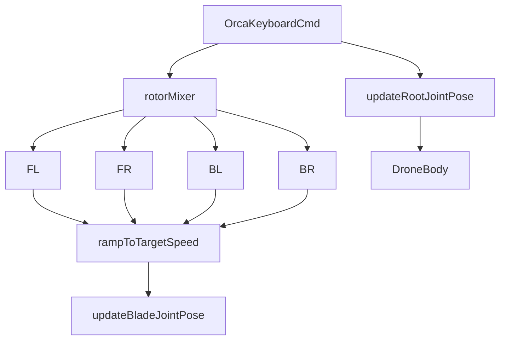

# Drone Driver 使用说明

本示例基于仓库内本地化模型 `examples/drone_driver/model/Drone_ver_1.0/drone-v1.xml`，当前只保留 `OrcaStudio` 通信版运行方式。

## ⚠️ 资产准备

- **资产**：使用本示例目录下的 `drone-v1.xml` 导入到 OrcaStudio，导入后请把对应 actor 拖入场景。
- **是否需要手动拖动到布局中**：**是**，运行前需要先把无人机摆进场景。

## 🔧 手动拖入资产进行调试

手动拖动资产的通用操作方式见**项目根目录 [README - 手动拖动资产（运行前必做）](../../README.md#-手动拖动资产运行前必做)**。

为了增添多场景物理交互，请先把无人机 actor 拖到布局中，再与地形、障碍物或其他场景元素一起调整位置。

脚本启动时会扫描场景中的关节、执行器、body 和 site 后缀，自动识别完整匹配的无人机实例；如果匹配不完整或场景里不是目标型号，会直接报错退出。

## 运行前准备

- 场景中需要且只能有 1 台完整匹配的无人机
- 机器人实例名不需要固定，脚本会自动绑定真实名称
- 本示例当前默认通过 OrcaStudio 键盘输入控制，不依赖终端焦点

## 运行

```bash
python examples/drone_driver/run_drone_orca.py
```

带参数运行：

```bash
python examples/drone_driver/run_drone_orca.py \
  --orcagym_addr localhost:50051 \
  --time_step 0.008333333 \
  --frame_skip 1 \
  --autoplay
```

说明：

- 当前默认把通信版仿真步长降到了约 `120Hz`，更适合观察旋翼动画。
- 传入 `--autoplay` 后，无人机会自动向前漫游，并叠加轻微下沉、左右摆动和偏航扰动。
- 所有启动、扫描和异常信息请查看左下角**终端按钮**中的输出。

## 键盘控制

| 按键 | 功能 |
|------|------|
| `w/s` | 前后平移 |
| `a/d` | 左右平移 |
| `r/f` | 升降 |
| `q/e` | 偏航 |
| `space` | 重置到当前样例初始姿态 |

启用 `--autoplay` 时：

- 自动持续向前
- 叠加轻微左右摆动
- 叠加轻微向下扰动
- 叠加轻微偏航扰动
- 仍然支持 `space` 重置

## 当前实现说明

- 当前只保留 OrcaStudio 通信版入口 `run_drone_orca.py`
- 四个旋翼按渐变角速度显示
- 躯干运动当前通过直接更新根关节位姿完成，便于和 OrcaStudio 导入模型稳定联动
- 后续如果要继续逼近理想方案，可以再切到按 `rotor_*_site` 分配推力

## 运动草图


