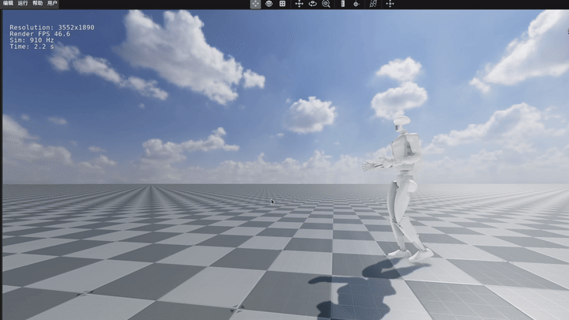

# OrcaLocomotion Quick Start

本示例通过 PyPI 包 `orca-locomotion` 在 OrcaLab 中回放 Unitree Go2 / G1 运动控制策略。
更多训练、资产和源码说明见 [OrcaLocomotion](https://github.com/openverse-orca/OrcaLocomotion/tree/dev)。

| 仿真 | 实机 |
| --- | --- |
|  |  |

## 安装

```bash
conda create -n orcalab python=3.12
conda activate orcalab
pip install orca-locomotion
```

如果安装依赖失败，再使用额外包源：

```bash
pip install --extra-index-url https://py.mujoco.org --extra-index-url https://pypi.nvidia.com orca-locomotion
```

## OrcaLab 资产订阅

回放前需要在 OrcaLab 中订阅 `unitree_robots` 资产包。Go2 和 G1 机器人预制件均来自该资产包。

运行 `Unitree-Go2-Rough` 还需要订阅 rough terrain 对应的渲染资产：

```text
OrcaPrimitiveTerrainXml
MjlabRough5x5xml_20260527
```

## 启动 OrcaLab

先启动 OrcaLab，然后选择：

```text
运行 -> 开始模拟 -> 无仿真程序 -> 启动
```

## 运行示例

```bash
orca-locomotion-play-go2-flat
orca-locomotion-play-go2-rough
orca-locomotion-play-g1-flat
```
